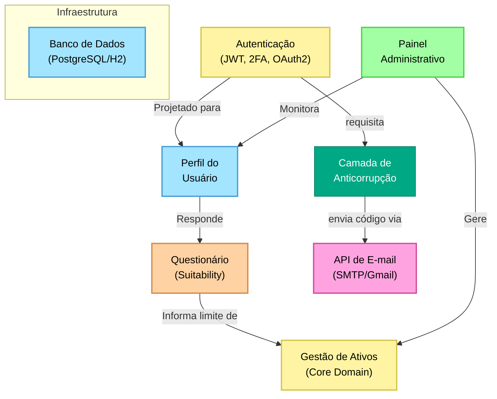

# INVESTE+ 🚀

[](https://openjdk.org/)
[](https://spring.io/projects/spring-boot)
[](https://spring.io/projects/spring-security)

O **INVESTE+** é um backend robusto e de alta performance para gestão de investimentos, construído com **Spring Boot 3.5** e **Java 25**. Desenvolvido com mentalidade *security-first*, o projeto implementa padrões avançados de autenticação, filtros de infraestrutura defensivos e segue rigorosamente os princípios **SOLID** e **Domain-Driven Design (DDD)** para garantir escalabilidade e manutenibilidade.

---

## 🛠 Tecnologias

- **Core**: Java 25 LTS & Spring Boot 3.5.x
- **Persistência**: PostgreSQL (Produção) / H2 (Desenvolvimento & Testes)
- **Segurança**: 
  - Spring Security com JWT (java-jwt)
  - Integração OAuth2 Client
  - Hashing de senhas com Argon2
  - Criptografia AES-256 no Banco de Dados para campos sensíveis
- **Infraestrutura**:
  - **Rate Limiting**: Implementação usando Bucket4j & Caffeine
  - **Validação**: Bean Validation (Hibernate Validator)
  - **Mapeadores**: MapStruct para conversão limpa entre Entidades e DTOs
- **Documentação**: OpenAPI 3 / Swagger (SpringDoc UI)
- **Utilitários**: Lombok, dotenv-java, BouncyCastle

---

## 🏗 Arquitetura e Princípios

Este projeto foi construído para transcender os padrões básicos de um MVP, adotando as melhores práticas de engenharia de software moderna:

- **Domain-Driven Design (DDD)**: Lógica organizada por limites de domínio (`auth`, `user`, `asset`, `admin`).
- **Princípios SOLID**: Foco no desacoplamento, responsabilidade única e design orientado a interfaces.
- **Programação Defensiva**: Validação extensiva de entradas e tratamento padronizado de erros.
- **Endurecimento de Segurança (Hardening)**:
  - Tokens JWT de curta duração com lista de bloqueio (*blacklist*) no servidor (hasheada).
  - Implementação de 2FA (Autenticação de Dois Fatores) em múltiplas camadas.

---

## 🗺 Mapa de Contexto (DDD)

Abaixo está a representação visual dos **Contextos Delimitados** (Bounded Contexts) do projeto e como eles se relacionam, baseada no design de "post-its":



---

## ✨ Funcionalidades Principais

### 🔐 Autenticação Segura
- **Fluxo JWT**: Autenticação stateless com validação automática de tokens.
- **2FA**: Autenticação de dois fatores via e-mail para logins e ações críticas.
- **OAuth2**: Suporte para login via provedores externos.
- **Logout**: Encerramento seguro de sessões usando uma blacklist no servidor.

### 🛡 Resiliência de Infraestrutura
- **Rate Limiting**: Proteção contra DDoS e ataques de força bruta implementada em nível de filtro.
- **Detecção de Anomalias**: Identificação de padrões comuns de varredura (scanning).
- **HTTPS/SSL**: Suporte nativo a certificados autoassinados para desenvolvimento local.

### 📈 Gestão de Investimentos
- **Controle de Ativos**: Gestão de portfólios de investimentos diversos.
- **Painel Administrativo**: Endpoints especializados para controle da plataforma e auditorias.

---

## 🚀 Como Começar

### Pré-requisitos
- JDK 25
- Maven 3.x
- H2 / PostgreSQL

### Configuração
1. Clone o repositório.
2. Crie um arquivo `.env` na raiz do projeto baseado no seguinte modelo:

```env
# Credenciais de E-mail (2FA)
MAIL_HOST=smtp.gmail.com
MAIL_PORT=587
MAIL_USERNAME=seu-email@gmail.com
MAIL_PASSWORD=sua-senha-de-aplicativo

# Segurança
JWT_KEY=sua-chave-secreta-de-32-caracteres
DB_ENCRYPTION_KEY=sua-chave-aes-de-32-caracteres

# Banco de Dados
DB_URL=jdbc:h2:mem:testdb
DB_USERNAME=sa
DB_PASSWORD=
```

### Executando a Aplicação
```bash
./mvnw spring-boot:run
```

A aplicação estará disponível em `https://localhost:8443` (Porta HTTPS padrão).

---

## 📖 Documentação da API

A documentação interativa da API é gerada automaticamente e pode ser acessada em:

- **Swagger UI**: `https://localhost:8443/swagger-ui.html`
- **OpenAPI Spec**: `https://localhost:8443/v3/api-docs`

---

## Conformidade

Este projeto foi desenvolvido seguindo as diretrizes da **Lei Geral de Proteção de Dados (LGPD)**. Para detalhes sobre o inventário de dados, base legal e políticas de segurança, consulte o documento abaixo:

- [Dossiê de Conformidade LGPD](docs/CONFORMIDADE_LGPD.md)